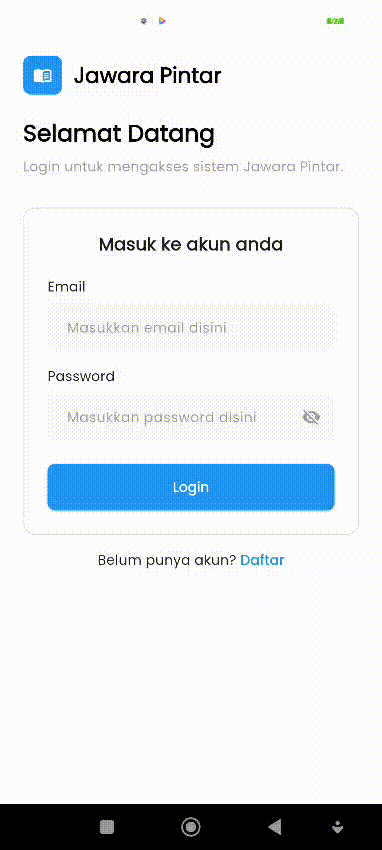
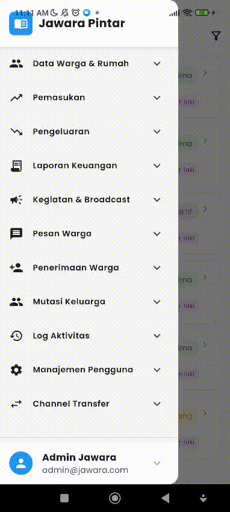
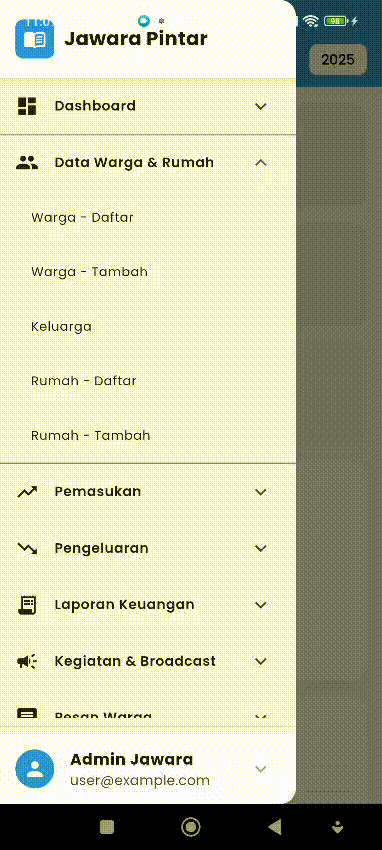
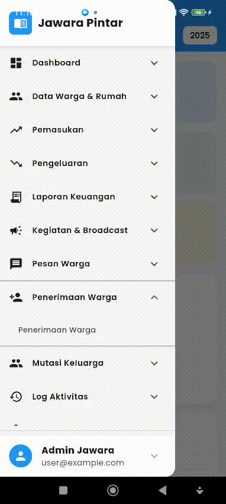
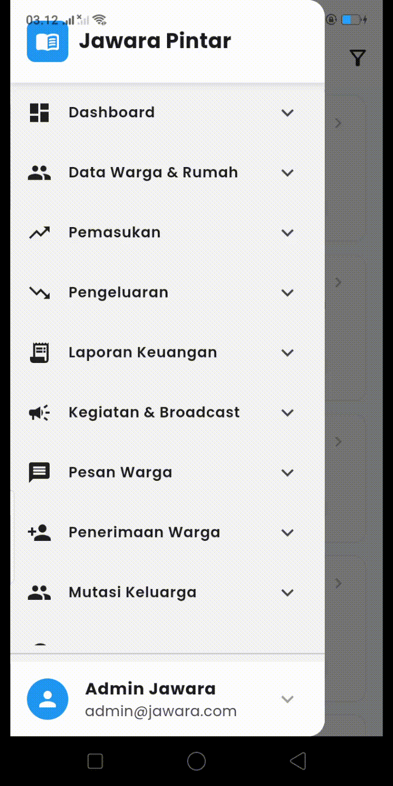
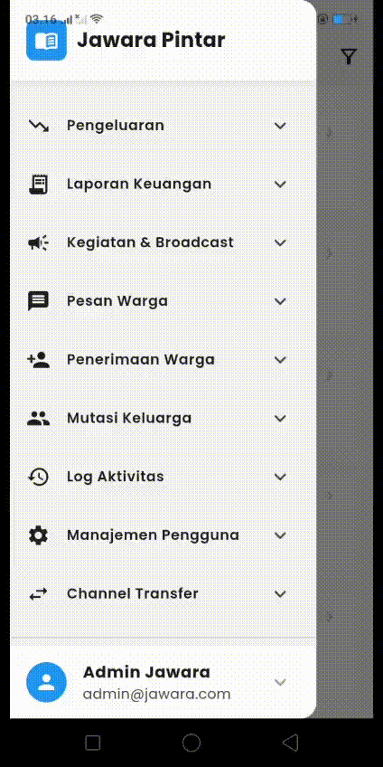
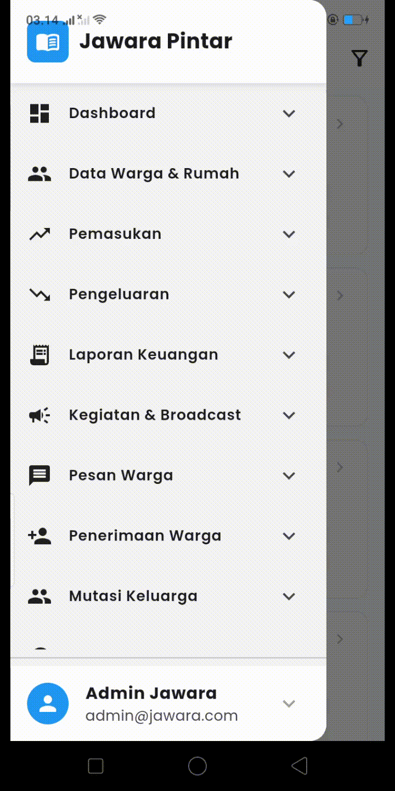

# 📱 Project Mobile **PBL**

## 👥 Kelompok 3

| **Nama**                    | **NIM**        | **Deskripsi Jobdesk**                                         |
|-----------------------------|----------------|---------------------------------------------------------------|
| Atabik Mutawakilalallah     | 2341720090     | Dashboard & kelola keuangan                                   |
| Gilang Purnomo              | 2341720042     | Register, Login, Logout, Data Warga & Rumah, Penerimaan Warga |
| Kibar Mustofa               | 2341720034     | Manajemen pengguna, mutasi keluarga, chanel transfer          |                                                     
| Michelle Dorani Shiba       | 2341720113     | Sidebar, Pemasukan, & Pengeluaran                             |
| Rafi Ody Prasetyo           | 2341720180     | Manajemen Broadcast & Kegiatan, Aktivitas Log, Pesan Warga    |

---

## Tampilan

### Login & Register

### Logout

### Data Warga & Rumah

### Keluarga

### Penerimaan Warga

### Manajemen Kegiatan

### Manajemen Broadcast

### Aktivitas Log

### Pesan Warga

### Manajemen Pengguna

### Mutasi Warga

### Chanel Transfer
